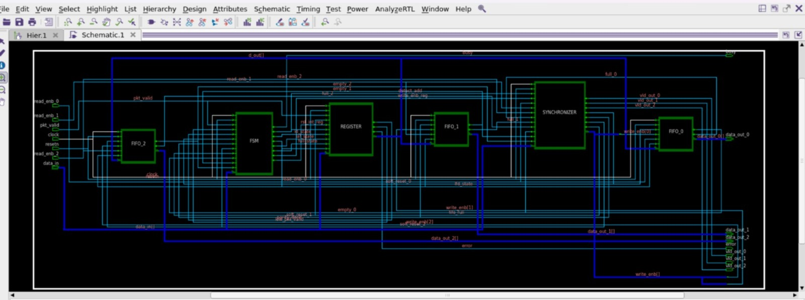
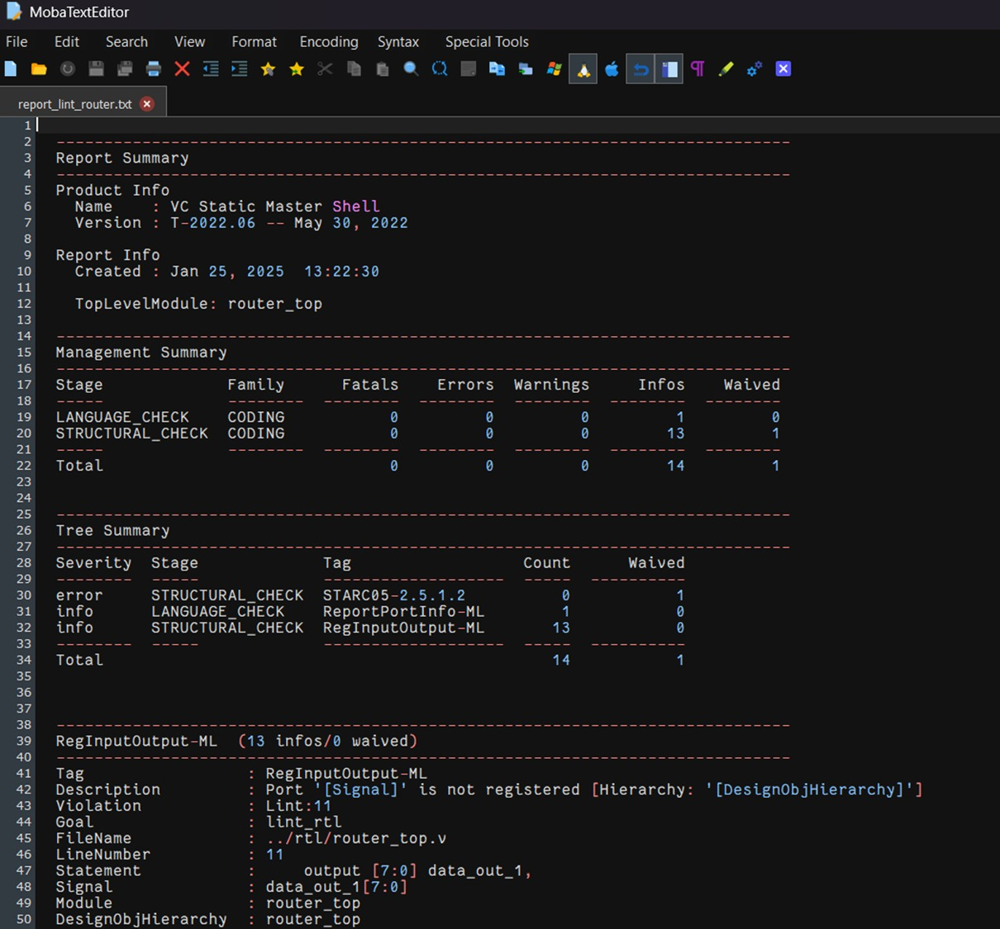
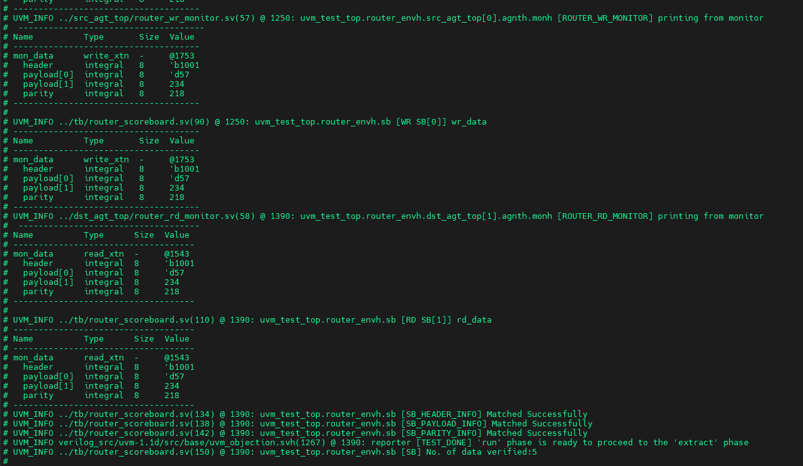
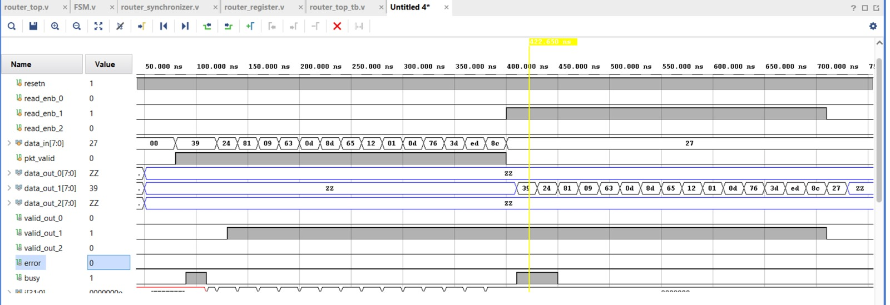

# Router 1x3 – RTL Design and Verification

## 📌 Overview
 Built an 8-bit packet router with one source and three addressable destination ports
 • EDA Tools: QuestaSim, Xilinx– Vivado 
 • Languages: Verilog, SystemVerilog
 • Designed RTL architecture including datapath, FSM, and FIFO buffering
 • Created UVM testbench with standard UVM components and assertions to verify routing logic

## 📁 Folder Structure
- `rtl/` – RTL modules: router_top, FSM, FIFO, register, synchronizer, interface
- `tb/` – Testbench environment: top module, environment, config, scoreboard, virtual sequencer/sequence
- `src_agt_top/` – Source agent: driver, monitor, sequencer, sequences, transaction, agent, config
- `dst_agt_top/` – Destination agent: monitor, driver, sequencer, sequences, transaction, agent, config
- `test/` – UVM testcases, test package, definitions
- `sim/` – Simulation makefile and run scripts

## ✅ Features
- Full UVM environment
- Functional coverage
- Assertion-based verification
- FIFO and FSM-based routing logic

## 🖼️ Waveform & Tool Snapshots

### ✅ Synthesis Report

### ✅ Linting Report

### ✅ Simulation Waveforms

**QuestaSim Output:**  

**Vivado Output:**  

## 👤 Author
Raj Kushwaha  
🔗 [LinkedIn](https://linkedin.com/in/kushwaharaj)  
🔗 [GitHub](https://github.com/Kushwaharaj)

